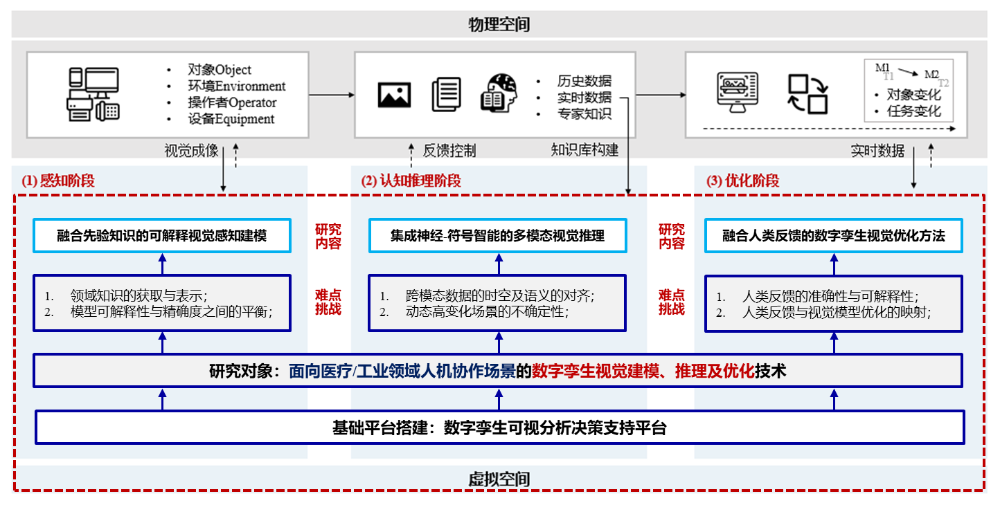

# Hi, I'm Zehebi 👋

I work on **AI for digital twins and human-in-the-loop visual intelligence**, focusing on building data-efficient, explainable, and deployable CV/ML systems for **healthcare** and **industrial** scenarios.

---

## Research Snapshot

My recent research centers on **visual modeling → multimodal reasoning → optimization** for digital-twin applications, especially under real-world constraints (limited labels, dynamic environments, and deployment latency).

- **Explainable visual perception with prior knowledge**
- **Neuro-symbolic / multimodal visual reasoning**
- **Human feedback–guided visual optimization**

---
## Contact
- Email:zhb@mail.dhu.edu.com
